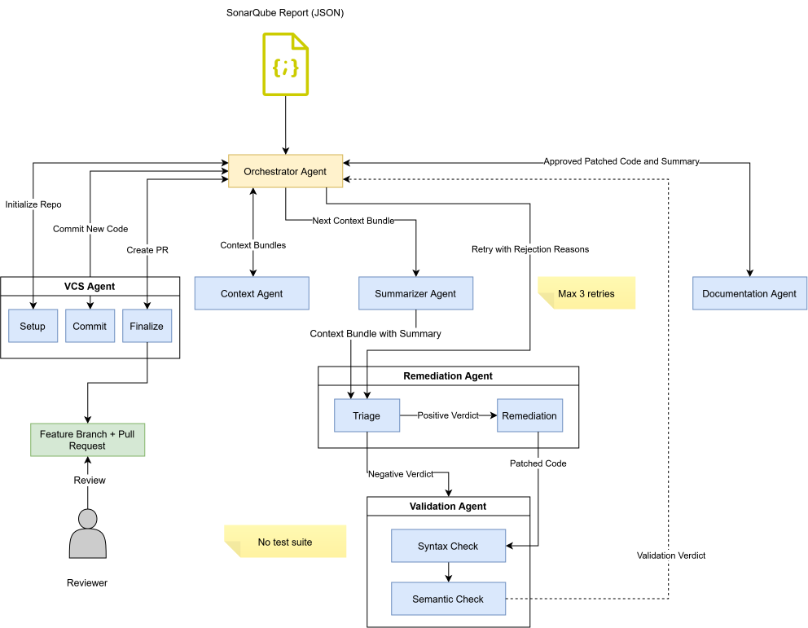

# Multi-Agent Technical Debt Remediator

A privacy-focused, agentic AI workflow that automatically remediates code-level technical debt using locally deployable open-weight language models. It reads a static analysis report from SonarQube, fixes the flagged issues through a multi-agent pipeline and opens a pull request for human review, all without sending any source code to a third party.

This is the reference implementation for the Master's thesis *Privacy-Focused Agentic AI Workflow with Locally Deployable Language Models for Technical Debt Remediation in Software Systems* (University of Turku).

## How it works

The pipeline is built on [LangGraph](https://www.langchain.com/langgraph). A rule-based Orchestrator drives the run and routes work to specialized agents, four of which are backed by a language model. Agents never call each other directly; they communicate through a single shared, typed state object.



| Agent | Role | LLM |
| --- | --- | --- |
| Orchestrator | Rule-based state machine that ranks work and routes every step | No |
| Context | Extracts the target function with tree-sitter and assembles the context bundle | No |
| Summarizer | Produces a behavioural contract the fix must not violate | Yes |
| Remediation | Triages the issue, then generates a full replacement function | Yes |
| Validation | Splices, syntax-checks and semantically reviews the patch | Yes |
| Documentation | Writes docstrings and a conventional-commit message | Yes |
| VCS | Clones, branches, commits per file and opens the pull request | No |

## Requirements

- A GitHub token with repository and pull-request write access
- An OpenAI-compatible LLM endpoint (for example a local [Ollama](https://ollama.com) server)
- Docker and VS Code with the Dev Containers extension

## Getting started

1. Open the project in VS Code and choose **Reopen in Container**.
2. Install the dependencies:

   ```bash
   uv sync
   ```

3. SonarQube is available at [http://localhost:9000](http://localhost:9000) (login `admin`/`admin`). Scan a target project and generate an API token for the pipeline.

## Configuration

Copy `.env.example` to `.env` and fill in the values:

```bash
cp .env.example .env
```

| Variable | Purpose |
| --- | --- |
| `GITHUB_TOKEN` | Token with repo + pull-request write access |
| `SONARQUBE_TOKEN` | Bearer token from SonarQube (My Account → Security → Generate Tokens) |
| `OLLAMA_MODEL` | Model name to serve, e.g. `qwen3.5:27b` |
| `OLLAMA_BASE_URL` | OpenAI-compatible endpoint, e.g. `http://localhost:11434/v1` |
| `OLLAMA_API_KEY` | API key for the endpoint (leave empty for a local Ollama) |
| `MAX_TOKENS` | Response token cap (default `8192`) |
| `NUM_CTX` | Context window size (default `32768`) |
| `DEBUG` | `true`/`1` for verbose logging, `2` also logs prompts |

## Usage

Three steps. The report from step one is the pipeline's only external input. Optional flags are shown in square brackets.

**1. Fetch a SonarQube report** into `data/`.

```bash
python fetch_report.py --project-key <key> --git-link <repo-url> [--sonar-url http://sonarqube:9000]
```

**2. (Optional) Draw a stratified sample**, keeping a large backlog feasible while preserving the spread of issue types and severities.

```bash
python stratify.py --report <report.json> [--sample-size 100] [--min-per-type 15] [--seed 42] [--output <path>]
```

**3. Run the pipeline.** Remediates each issue and opens a pull request.

```bash
python run.py --report <report.json> [--project-dir path/to/repo]
```

Runs are checkpointed per issue, so an interrupted run resumes where it stopped when re-invoked with the same report.

To keep a log of a run, pipe the output through `tee`:

```bash
python run.py --report <report.json> 2>&1 | tee logs/run.log
```

## Language support

Function extraction and patching are language-aware through tree-sitter. TypeScript and JavaScript are tested in the thesis. Grammars for Python, Java and C# are registered as well but untested. Adding another language mainly means registering its grammar and function node types.

## Project structure

```
.
├── agents/          # the LLM and rule-based agent nodes
├── data/            # fetched reports and samples (generated at runtime)
├── .devcontainer/   # dev environment with Python, SonarQube and PostgreSQL
├── run.py           # pipeline entry point
├── graph.py         # LangGraph pipeline wiring
├── fetch_report.py  # turns a SonarQube scan into a report JSON
├── stratify.py      # stratified sampling of a report
├── state.py         # shared pipeline state
└── checkpoint.py    # per-issue checkpoint and resume
```

## License

MIT
